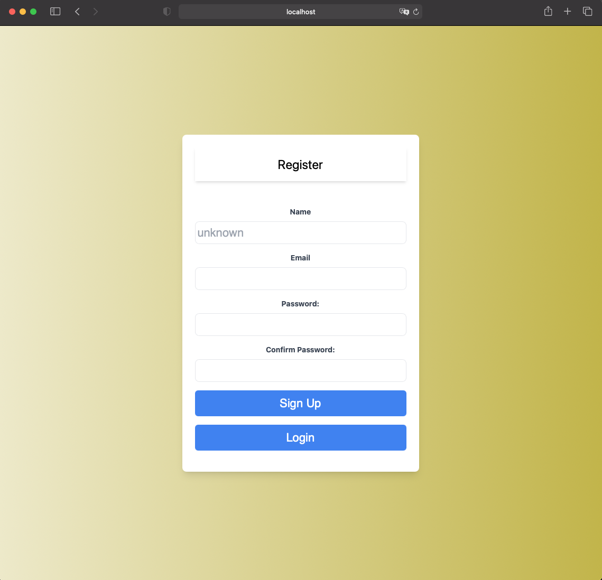

# Dice-game


[](https://github.com/rikiDalvarez/Dice-game)

Application built with hexagonal architecture and TDD.

## Login & Register

<div style="display: flex ;">
  
  
</div>

## Dashboard


To start the server side navigate to the server folder and create a .env file with the following content:

```env
MONGO_URI="yourMongodbUri"
MONGO_URI_TEST="mongodbUriForTest"
NODE_ENV="development"
DATABASE_ENV='mongo'
TEST_DATABASE='test'
DATABASE="dicegame"
PORT="8012"

SQL_URI='mysql://127.0.0.1'
MYSQL_USER='root'
MYSQL_PASSWORD='password'
HOST='127.0.0.1'

JWT_SECRET='yoursecret'
```

Then run the following commands:

```bash
npm install
```

if you want to run the app with a mongodb database run:

```bash
npm run devmongo
```

if you wish to run the app with a mysql database run:

```bash
npm run devmysql
```

## API DOCUMENTATION

if you .env is set with port 8012 if not just adjust the port. You can access the api documentation with the following commands:

first create a player with email and password, name is optional, if name is not provided the default will be "anonim":

```bash
curl -X POST -d "name=John&email=john@example.com&password=secretpassword" http://localhost:8012/api/players
```

then login with the email and password to get the token:

```bash
curl -X POST -d "email=john@example.com&password=secretpassword" http://localhost:8012/api/login
```

### Now you can access the api documentation with the following command always adding the token as bearer:

to change name:

```bash
curl -X PUT -H "Authorization: Bearer <YOUR_TOKEN>" -d "name=Ronaldinho" http://localhost:8012/api/players/<your_player_id>
```

to get player list:

```bash
curl -X GET -H "Authorization: Bearer <YOUR_TOKEN>" http://localhost:8012/api/players/
```

to play game:

```bash
curl -X POST -H "Authorization: Bearer <YOUR_TOKEN>" http://localhost:8012/api/games/<your_player_id>
```

to get games:

```bash
curl -X GET -H "Authorization: Bearer <YOUR_TOKEN>" http://localhost:8012/api/games/<your_player_id>
```

to delete all games from a player:

```bash
curl -X DELETE -H "Authorization: Bearer <YOUR_TOKEN>" http://localhost:8012/api/games/<your_player_id>
```

to get Ranking list:

```bash
curl -X GET -H "Authorization: Bearer <YOUR_TOKEN>" http://localhost:8012/api/ranking
```

to get Looser:

```bash
curl -X GET -H "Authorization: Bearer <YOUR_TOKEN>" http://localhost:8012/api/ranking/loser
```

to get Winner:

```bash
curl -X GET -H "Authorization: Bearer <YOUR_TOKEN>" http://localhost:8012/api/ranking/winner
```


